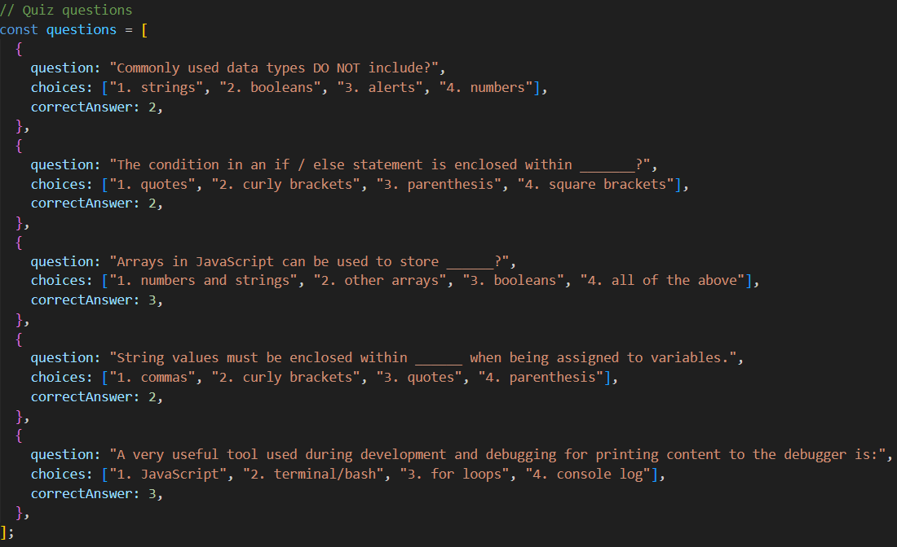
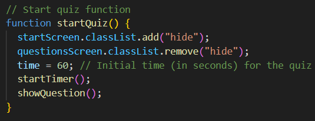
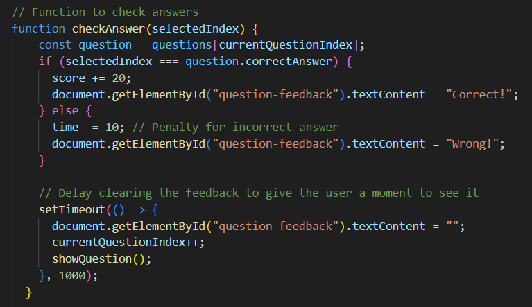

# Coding Quiz Application

This is a web-based coding quiz application that allows users to test their knowledge of JavaScript fundamentals while competing against a timer. The application also provides a way to save and view high scores.

## Features

- Start the quiz by clicking the "Start Quiz" button.
- Answer a series of JavaScript-related questions under a time limit.
- Receive "Correct" or "Wrong" feedback for each question.
- If you answer a question incorrectly, time is subtracted from the clock.
- When all questions are answered or the timer reaches 0, the game is over.
- Save your initials and score after completing the quiz.
- View high scores on the "Highscores" page.
- Clear high scores if needed.

## Usage

1. Open the `index.html` file in your web browser to start the quiz.

2. Click the "Start Quiz" button to begin the quiz.

3. Answer the questions by selecting one of the multiple-choice options.

4. Receive immediate feedback for each question.

5. If you complete the quiz or the timer runs out, enter your initials and click "Submit" to save your score.

6. To view high scores, click on the "View Highscores" link at the top of the page.

7. On the "Highscores" page, you can clear high scores by clicking the "Clear Highscores" button.

## Technology

- HTML, CSS, and JavaScript are used to create the quiz application.

## Code Description
These are the quiz questions.

This function starts the quiz

This functions checks for the correct answer to quiz questions

## Customization

- You can customize the quiz by adding or modifying questions in the `questions.js` file.
- Styling can be customized by editing the `styles.css` file to match your preferences.

## License

This project is licensed under the MIT License. See the [LICENSE.md](LICENSE.md) file for details.

## Acknowledgments

This project was created as a coding exercise and is associated with the Skills For Life coding boot camp.

Feel free to reach out with any questions or issues related to this application.

Enjoy the quiz and happy coding!
